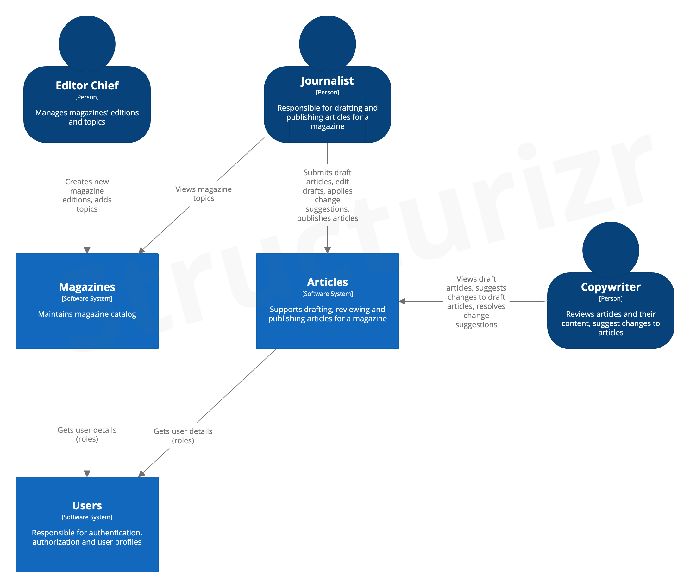
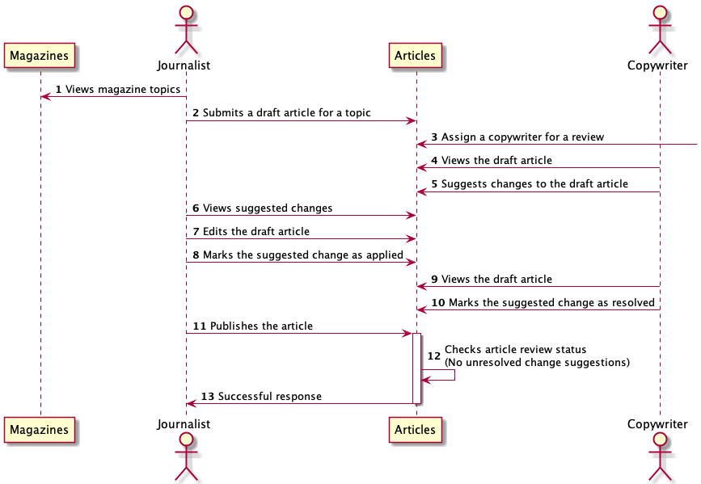
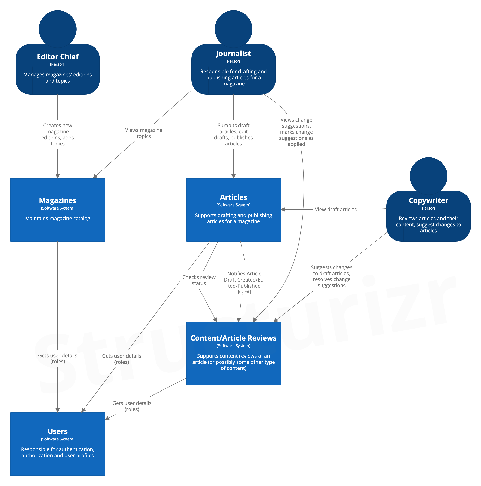
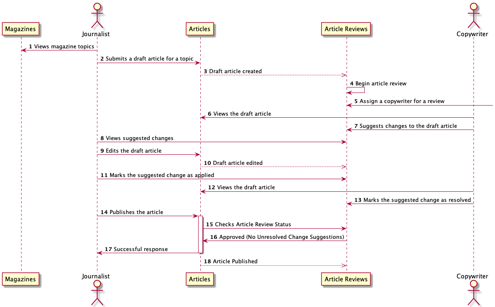
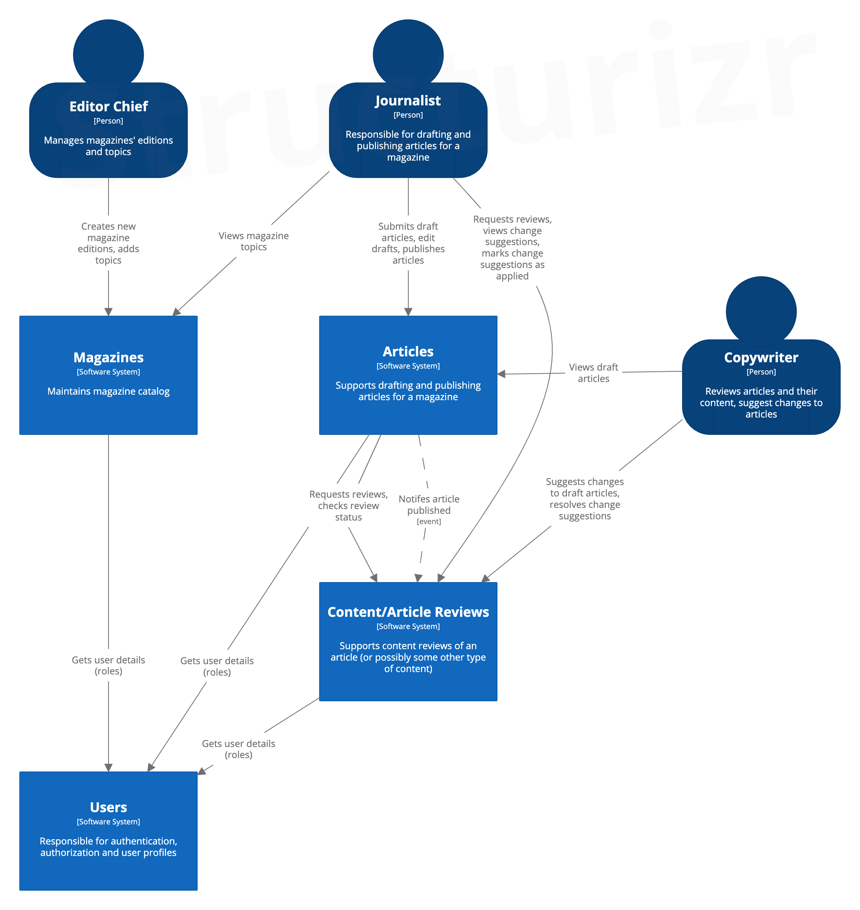
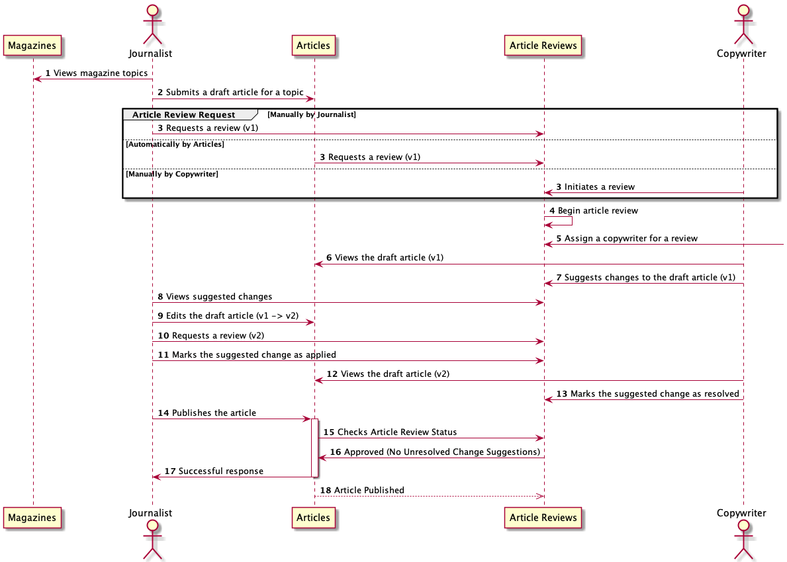

# Publishing House

## Background

There is a publishing house, which publishes the "Layer Weekly" magazine. The management of the publishing house all of
a sudden decided to switch their employees to fully remote positions. In the process of establishing how the company
would handle it, the management came up with a solution to exchange articles by e-mail. Unfortunately, the process was
long and error-prone, so the Editor in Chief decided that they need a collaboration tool to ease the process of drafting
and publishing articles. "IT to the rescue"! — our story begins here.

## User Stories/Requirements

1. As an editor in chief, I add a list of topics for the new edition of a magazine.
2. As a journalist, I submit a draft article for publishing to a given topic
3. As a copywriter, I suggest changes to the draft article I'm assigned to
4. As a journalist, I respond to suggestions by making the suggested changes
5. As a copywriter, I resolve suggestions that the journalist applied
6. As a journalist, I can publish the article after all suggestions are resolved

## Analysis

**How I gathered all required information for architecting the domain model?** By analyzing the behavior and
requirements with BDD scenarios, possibly by collaborating with the client (asking questions, possibly event storming),
by coming up with different architectural options how the system could look like and behave, possibly by requesting
other developers to pear review my analysis. Heavily inspired by `Minimum viable analysis for non obvious features` by
Jakub Nabrdalik. In the end, the problem undestanding will still be refined during implementation in an iterative
manner.

We're given some basic premise of the applications, and the description of what it is supposed to do.

So let's try to formalize it a bit more with BDD scenarios, and some other techniques to validate that we actually
understand the problem and know how it's supposed to work, probably refining the whole process with the client.

First attempt in formalizing the behaviour with BDD can be found in this commit: https://github.com/knizamov/publishing-house/commit/1b360b5db42032b9b4137e62bd77169cbe44d192

Of course, those will be refined during the whole process and implementation.

### Acceptance scenario (Article drafting, reviewing, and publishing)

1. **When** A journalist submits a draft article (title, text, topics)
2. **Then** The draft article is created with the provided content and can be viewed
 

3. **Given** A copywriter is assigned to the article
4. **When** The copywriter suggests a change to the article
5. **Then** The change suggestion is attached to the given article and can be viewed
 

6. **When** A journalist tries to publish the article
7. **Then** The operation is rejected due to unresolved change suggestions
 

8. **When** The journalist views the article change suggestions
9. **Then** They can see the new change suggestion
 

10. **When** The journalist makes the change suggestion by editing the article
11. **Then** The article is edited with the provided content
12. **When** The journalist marks the change suggestion as applied
13. **Then** The change suggestion is marked and can be viewed as applied
 

14. **When** The copywriter reviews the applied change suggestion
15. **And** Marks it as resolved
16. **Then** The change suggestion is marked and can be viewed as resolved
 

17. **When** The journalist publishes the article
18. **Then** The article is published (status is changed)

### Assumptions

**How I came up with assumptions?** Assumptions are based on the given user stories, predefined rules and requirements,
further questions and my assumptions are based on the current best understanding of the problem after the initial
analysis, i.e. bdd scenarios, questions, diagrams, architectural options, to fit the current problem without
overcomplicating it, of course my assumptions could be refined with the client.

- An article is a simple text with a title and some headings
- The draft article:
    - needs to have title and content
    - can be connected to multiple topics
- Journalists cannot change each other's drafts
- Copywriters can only suggest changes to article they were assigned to.
- Suggested changes can be considered as comments to the whole article. They should be non-empty chunks of text.
- Once the article is published, suggestions are no longer allowed.

Other assumptions (that are feasible to be formalized) can be found in the tests.

### Questions

- An article is a simple text with a title and some headings: is there something special about headings or any other
  content type that we need to possible handle in some way or do something with it?
    - Current assumption: There is nothing special about headings, content of an article is an arbitrary text
  
- Should there be some content formatting checks (e.g. uppercase title, uppercase paragraphs etc)
    -Current assumption: No

Story 2: Journalist submits article drafts

- Submit vs create a draft article. Is there something in between summiting and creating a draft?
    - Current assumption: No, a draft is created immediately after a submission
- Can an article be connected to a non-existent topic?
    - Current assumption: Yes both for a draft and published article
- What happens to the draft/published article when the topic is deleted?
    - Current assumption: I have no idea -> out of scope
- Can journalists view each other's draft articles?
    - Current assumption: Yes
- Can journalists edit each other's draft articles?
    - Current assumption: No (without the appropriate permission)

Story 3. As a copywriter, I suggest changes to the draft article I'm assigned to  
Story 4. As a journalist, I respond to suggestions by making the suggested changes  
Story 5. As a copywriter, I resolve suggestions that the journalist applied

- How would you define a role of a copywriter?
    - Current assumption: Reviews articles and their content, suggest changes to articles.
- Who, when and how assigns a copywriter to the article?
    - Current assumption: Partially out of scope. It doesn't matter, a copywriter can be assigned by anyone anytime
      (including by the system or copywriter themselves)
- Is the draft article available for a review immediately after the draft article was created or edited?
    - Current assumption: Yes, a copywriter can start suggesting changes as soon as there is a draft or new version.
- Is there any more elaborate reviewing process? Is there any draft article versioning?
    - Current assumption: No, just simple change suggestions as comments. Reviewing process happens to the latest
      version of a draft article.

Story 6: Journalist publishes articles

- What is meant by publishing an article? Where are they published to?
    - Current assumption: I have no idea -> currently, it will just change its status to PUBLISHED with no further
      behavior
- Is it possible to publish an article without a review?
    - Current assumption: Yes
- What happens when the journalist tries to publish the article after all the suggestions were resolved but right after
  clicking the "publish button" the copywriter suggest a change
    - Current assumption: I have no idea -> out of scope
- Can article be edited after if was published? How can it be republished?
    - Current assumption: I have no idea -> out of scope
- Are there any additional rules that needs to be checked before publishing an article in addition to checking
  unresolved change suggestions? Maybe checks whether the topics or magazine exist?
    - Current assumption: No

## Architecture

After gathering, refining and validating the requirements and scenarios, lets try to design an appropriate architecture
for the given requirements. The purpose is to provide a high level big picture of the system so that it's easier both
for developers and other non-technical people to understand what parts of the system there are, their boundaries and how
they communicate and fit together ideally aligning with the business organization itself.

**Actors:**

- `Chief Editor` - Manages magazine editions and their topics
- `Journalist` - Responsible for drafting and publishing articles for a magazine
- `Copywriter` - Reviews articles and their content, suggest changes to articles.

We'll focus on `Articles` domain since the premise and requirements are defined mainly around this problem space.

Since we're focusing on `Articles` domain, `Magazines` will not be part of our solution space for now
(it will be reflected in the big picture architecture diagram though) because `Articles` seems to be quite independent
of it, at most we'll need some magazine id and topics.

The `Users` Software System is also going to be considered fixed and external (as it's often the case), because there is
no need for us to manage any of the user information (at least for now). It's needed for the sole purpose of getting the
user details (mostly roles) to be able to authorize operations and distinguish each individual Actors. In fact,
`Users` might not necessarily be represented as a system but also as its JWT token or some other source.

As it's often the case, complexity lies in the interactions/relationships/communication patterns between the possible
bounded contexts/boundaries/modules that might be unclear and unstable. In this case between the article
drafting/publishing and reviewing process. So different architectural options are what we are going to consider next.
The purpose is not to specify every single detail but to see the big picture and understand main interactions.

### 1. Single Articles module

This architecture represents a single module for `Articles`

- `Articles` - supports drafting, reviewing and publishing articles for a magazine

Given the nature of our requirements, some communication patterns between **Article Drafting/Publishing** and **Article
Reviews** are unclear
(see [option 2.a](#2a-articles-and-contentarticle-reviews-modules-implicit-review-requests) for more details). That's
why I'm a bit reluctant to include those concerns in the high level architecture setting hard boundaries that we are
unsure of.

Setting boundaries and splitting the solution into 2 modules would mean having a contract between them which also means
that ideologically we have to mock a module in our tests
(see "Keep IT clean" talk by Jakub Nabrdalik). Also, I once asked Jakub Nabrdalik how to deal with the situation when
you have an acceptance test that covers multiple modules but in the future you might decide to extract a module into its
own microservice and it's no longer easy to run a single acceptance test because now you have 2 applications. I got an
answer from Jakub Nabrdalik that they had moved away from an acceptance test for more than one module for this exact
reason.

So, this option is going to hide **Article Drafting/Publishing** and **Article Review** concerns and keep them as an
implementation detail but internally it's going to be similar to
the [option 2.a](#2a-articles-and-contentarticle-reviews-modules-implicit-review-requests) or
[option 2.b](#2b-articles-and-contentarticle-reviews-modules-explicit-review-requests)
This will allow us to wait for more requirements/refinements/changes and see what direction to take and solidify it in
the architecture later. But of course we have to keep an eye on this architecture not to create a Big Ball of Mud.

- Pros
    - Simpler solution
    - Have time to mature and not having to set boundaries and contracts too early while still maintaining simplicity
    - Tests are easier to write compared to multiple modules

- Cons
    - Having one bigger module is more prone to being neglected and turning into a BBOM

### 2.a Articles and Content/Article Reviews modules (implicit Review Requests)

Let's try to stretch the boundaries of our systems. Let's apply a heuristic and imagine how the process of drafting,
reviewing and publishing could look like in real life done on paper by people. So, there is a `Journalist` that has a
list of topics for a magazine that they need to write an article about. So, the journalist start from a draft article.
Now, the next step depends on how we define the role of a `Copywriter`. Let's assume that this is someone who does a
content review and specific (marketing) suggestions to article content. It's quite possible that there might be some
_independent_ `Article Review` department or perhaps some even more generalized one like `Content Review` department
that reviews any kind of content. So, when the draft article is ready for a review, journalist might hand it over to the
`Article/Content Review` department and collaborate with them. When every suggestion is resolved, the article can be
published (or perhaps marked as ready for publishing?).

This architecture splits **Articles** domain into two modules respecting the organizational boundaries that we defined.

- `Articles` (alternatively `Article Publishing`, `Article Writing`) - supports drafting and publishing articles for a
  magazine
- `Article/Content Reviews` - supports content reviews of an article (or possibly some other type of content)

This option becomes more valuable if we can spot a trend that Article Drafting/Publishing and Reviews becomes more and
more rich in features and more independent of each other. For now it's hard to tell whether this will be the case.

- Pros
    - Assuming our assumptions about the organization are correct, this option better aligns with the business
      respecting its boundaries
    - More formalized and detailed communication and structure with more specified responsibilities

- Cons
    - There is quite a bit of chattiness in regard to data ownership and in regard to what module should be contacted
      for the data by the actors
    - The communication, responsibilities and structure may not be stable and mature enough to promote it to the level
      of high level architecture given some of the business requirements and assumptions are unstable and ambiguous
      itself
    - Bigger structural changes in application code and tests needed if we get the boundaries wrong

### 2.b Articles and Content/Article Reviews modules (explicit Review Requests)

Previous options didn't consider `Article Review` process much, it was somewhat implicit. In the previous option one can
see that `Articles` publishes events to `Content/Article Reviews` (or rather the other module listens to those events)
which might trigger some article review process.

Those events might reveal too much of internal information of `Articles` module and impose some unnecessary degree of
coupling and also maybe not every draft article change should go into the reviewing process immediately. Let
the `Journalist` decide what version of the draft article should go into the review. So, what we could consider instead
is to make Article Review requests explicit by making a journalist request a review for a specific version of a draft
article directly in `Content/Article Reviews` module. It will also be possible for `Articles` module (automatically) or
the `Copywriter` actor to initiate and drive the reviewing process if needed. Of course, some of the actions (e.g.
editing and requesting a review for the new edition right away) could be automated by the UI of a Module so that
Journalist does not have to do it manually each time.

- Pros
    - all the pros of [option 2.a](#2a-articles-and-contentarticle-reviews-modules-implicit-review-requests)
    - `Articles` reveals less internal state to `Content/Article Reviews`

- Cons
    - all the cons of [option 2.a](#2a-articles-and-contentarticle-reviews-modules-implicit-review-requests)

### Decision on the architecture

Given aforementioned options and their pros and cons, we are going to choose
[Single Articles module](#1-single-articles-module) as counteraction to somewhat ambiguous future business requirements
and assumptions. This option seems the most simplistic while allowing to more easily adapt to future changes without
committing to hard boundaries on things that are likely to change or that are uncertain. The implementation will also
borrow ideas from the other options and will allow us to validate and choose what communication patterns fit better and
possibly promote them to the higher level architecture later.

The decision is also recorded in the form
of [ADR-001-choosing-architecture](docs/adr/0001-choosing_architecture.md) (basically copied from here)
